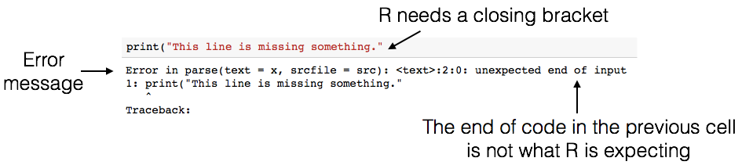
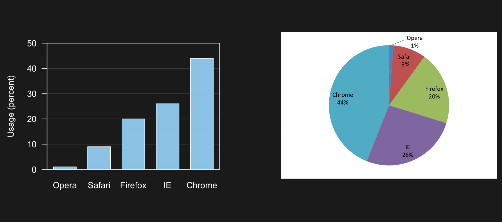

*Photos/Images by #WOCinTech/#WOCinTech Chat ([CC-BY](https://creativecommons.org/licenses/by/2.0/))*


### Team Introduction 

- Lead Instructor: [Katie Burak](https://katieburak.github.io/) (Assistant Professor of Teaching, Department of Statistics, UBC)
- Data Science Mentors: [Sky Sheng](https://awp.landfood.ubc.ca/people/graduate-students/kehan-sheng/), PhD student 

Thank you to our sponsors!

  


### Camp Motivation 

The main motivation for the development of this camp is to promote and uplift women and gender minorities in data science. The **leaky pipeline** is a phrase describing the phenomenon that even though women are interested in careers in STEM fields (including data science), they are disproportionately lost along the way as the level of their education and careers progresses. My hope is that camps like this one help to encourage and empower women to pursue careers in STEM fields, while exposing them to new and exciting topics in data science. 

### Ice Breaker Activity 

In small groups of 3–4, take turns answering the following questions to get to know each other:
1. **What’s your favorite school subject and why do you like it?**  
2. **Where is one place you’ve always wanted to visit and what would you do there?**
3.  **What’s one thing everyone in your group has in common that *isn’t* obvious?** 

## Day 1 Learning Objectives

- Edit and execute code and markdown in Jupyter notebooks
- Understand the essentials of the R programming language 
- Apply the basics of data manipulation and data visualization in R

### We've got a lot to do - let's get started!


# 1. Getting started with Jupyter & R

This webpage is called a Jupyter notebook. A notebook is a place to write computer code for analysis, view the results of the analysis, as well as to narrate the analysis with rich formatted text...

## 1.1. Text Cells
In a notebook, **each** rectangle containing text or code is called a *cell*.

Text cells (like this one) can be edited by double-clicking on them. They're written in a simple format called [Markdown](http://daringfireball.net/projects/markdown/syntax) to add formatting and section headings. For more practice using Markdown, try [this online tutorial](https://www.markdowntutorial.com/)!

After you edit a text cell, click the "run cell" button at the top that looks like ▶ to confirm any changes. (Try not to delete the instructions of the lab.)

## 1.2. Code Cells
Other cells contain code in the R language. Running a code cell will execute all of the code it contains.

To run the code in a cell, first click on that cell to activate it.  It will be highlighted with a blue rectangle to the left of it when activated.  Next, either press Run ▶ or hold down the `shift` key and press `return` or `enter`.
print("Hello, World!")
Try running the next cell:

```{r}
#| tags: []
print("Hi Sky!")
```

The above code cell contains a single line of code, but cells can also contain multiple lines of code. When you run a cell, the lines of code are executed in the order in which they appear. Every `print` expression prints a line. Run the next cell and notice the order of the output.

Note to self bla bla bla...

```{r}
#| tags: []
print("First this line is printed,")
print("and then this one.")
```

## 1.3. Writing Jupyter Notebooks
You can use Jupyter notebooks for your own projects or documents.  When you make your own notebook, you'll need to create your own cells for text and code.

To add a cell, click the + button in the menu bar of this tab.  The newly created cell will start out as a code cell.  You can change it to a text cell by clicking inside it so it's highlighted, clicking the drop-down box next to the restart and run all button (⏩) in the menu bar of this tab, and changing it from "Code" to "Markdown".

### Exercise

Add a code cell below this one.  Write code in it that prints out:
   
    My name is ____!

Run your cell to verify that it works. 

Next, add a text/Markdown cell and write the text "My name is ____!" in it.

## 1.4. Comments
Below you see lines like this in code cells:

    # Test cell; please do not change!

That is called a *comment*.  It doesn't make anything happen in R; R ignores anything on a line after a #.  Instead, it's there to communicate something about the code to you, the human reader.  Comments are extremely useful and can help increase how readable our code is.

The below code cell contains comments (one at the start of a line, and one after some other code). Run the cell. You will see that everything after a comment symbol `#` is ignored by R.

```{r}
#| tags: []
# you can use comments to document your code, or make R ignore some code without deleting it entirely
# print("this is a commented line that R will ignore. You won't see this text in the output!")

print("hello!") # you can also put comments at the end of a line of code
```

## 1.5. Errors
R is a language, and like natural human languages, it has rules.  It differs from natural language in two important ways:
1. The rules are *simple*.  You can learn most of them in a few weeks and gain reasonable proficiency with the language in a semester.
2. The rules are *rigid*.  If you're proficient in a natural language, you can understand a non-proficient speaker, glossing over small mistakes.  A computer running R code is not smart enough to do that.

Whenever you write code, you'll make mistakes (everyone who writes code does, even your course instructor!).  When you run a code cell that has errors, R will sometimes produce error messages to tell you what you did wrong.

Errors are totally okay; even experienced programmers make many errors. It's a natural part of the coding process.  When you make an error, you just have to find the source of the problem, fix it, and move on. 

We have made an error in the next cell. **Remove the `#` symbol below (i.e., uncomment the line)**, and then run the cell to see what happens.

```{r}
#| tags: []
print("This line is missing something.")
```



There's a lot of terminology in programming languages, but you don't need to know it all in order to program effectively. Even though the error message can seem cryptic, if you read it carefully you'll often find hints as to what went wrong. For example, above, you'll see the message `unexpected end of input` (among a lot of other technical jargon). In other words, R reached the end of the line of code, and wasn't expecting to reach the end -- it thinks there is still something missing!

Of course, even if you do your best to interpret the error message, sometimes you may get stuck figuring out what went wrong and how to fix it. In that case, ask someone.

Try to fix the code above so that you can run the cell and see the intended message instead of an error.

## 1.6 Saving your work

Its important to save your work often so you don't lose your progress! At the top of the screen, go to the **File** menu then **Save Notebook**. Also, there are keyboard shorcuts for saving your work too: control + s on Windows, or command + s on Mac. Once you've saved your work, you will see a message at the bottom of the screen that says **Saving completed**. 

## 1.7 Numbers

Quantitative information arises everywhere in data science. In addition to representing commands to print out lines, our R code can represent numbers and methods of combining numbers. The expression `3.2500` evaluates to the number 3.25. (Run the cell and see.)

```{r}
3.2500
```

Notice that we didn't have to write `print()`. When you run a notebook cell, Jupyter helpfully prints out that value for you. 

```{r}
#| tags: []
2
3
4
```

Above, you should see that the three numbers (2, 3, and 4) are printed out. In R, simply inputting numbers and running the cell will generate all the numbers that you listed.

## 1.8 Arithmetic
The line in the next cell performs some mathemtical operations. Run them!

```{r}
#| tags: []
2.0 - 1.5 + 45
```

```{r}
#| tags: []
2 * 2
```

```{r}
#| tags: []
6/2
```

```{r}
log(2)
```

Many basic arithmetic operations are built in to R.  [This webpage](https://www.statmethods.net/management/operators.html) describes many arithmetic operators that might be useful in this camp. 

## 1.9 Names
In natural language, we have terminology that lets us quickly reference very complicated concepts.  We don't say, "That's a large mammal with brown fur and sharp teeth!"  Instead, we just say, "Bear!"

Similarly, an effective strategy for writing code is to define names for data as we compute it, like a lawyer would define terms for complex ideas at the start of a legal document to simplify the rest of the writing.

In R, we do this with *objects*. An object has a name on the left side of an `<-` sign and an expression to be evaluated on the right.

```{r}
#| tags: []
answer <- 3*2 + 4
answer
```

When you run that cell, R first evaluates the first line.  It computes the value of the expression `3 * 2 + 4`, which is the number 10.  Then it gives that value the name `answer`.  At that point, the code in the cell is done running.

After you run that cell, the value 10 is bound to the name `answer`:

```{r}
#| tags: []
answer
```

> Note: You can also use an `=` sign for assignment

When naming objects in R there are some rules:
1. Names in R can have letters (upper- and lower-case letters are both okay and count as different letters e.g. "Answer" and "answer" will be treated as different objects), underscores, dots, and numbers. 
2. The first character can't be a number (otherwise a name might look like a number).  
3. Names can't contain spaces, since spaces are used to separate pieces of code from each other. 

Other than those rules, what you name something doesn't matter *to R*.  For example, the next cell does the same thing as the above cell, except everything has a different name:

```{r}
#| tags: []
a <- 3
b <- 2 * a + 4

b
```

Another common pattern is that a series of lines in a single cell will build up a complex computation in stages, naming the intermediate results.

**However**, names are very important for making your code *readable* to yourself and others.  The cell above is shorter, but it's totally useless without an explanation of what it does. 

There is also cultural style associated with different programming languages. In the modern R style, object names should use only lowercase letters, numbers, and `_`. Underscores (`_`) are typically used to separate words within a name (*e.g.*, `answer_one`).

### Exercise

Question: How old will you be in 2050?

- Assign an object called `age` which is your age now.
- Compute how many years will pass until 2050 by subtracting the current year from 2050 (call this object `years`).
- Finally, name an object `future_age` which adds together `age` and `years` to get your age in 2050.

```{r}
age <- 16
years <- 2050-2025
future_age <- age + years
future_age
```

## 1.10 Functions

The most common way to combine or manipulate values in R is by calling functions. R comes with many built-in functions that perform common operations.

We used a function `print()` at the beginning of this notebook when we printed text from a code cell. Here we'll demonstrate using another function `toupper()` that converts text to uppercase:

```{r}
#| tags: []
greeting <- toupper("Why, hello there!")
greeting
```

Try using the function `tolower` now! 

```{r}
tolower(greeting)
```

Some functions take multiple arguments, separated by commas. For example, the built-in `max` function returns the maximum argument passed to it.

```{r}
#| tags: []
biggest <- max(4,7,23,1,5)
biggest
```

Try to use the `min` function now to find the smallest number!

## 1.11 Packages

R has many built-in functions, but we can also use functions that are stored within packages created by other R users. We are going to use a package, called `tidyverse`, to load, modify and plot data.
This package has already been installed for you. Later in the course you will learn how to install packages so you are free to bring in other tools as you need them for your data analysis. 

To use the functions from a package you first need to load it using the `library` function. This needs to be done once per notebook (and a good rule of thumb is to do this at the very top of your notebook so it is easy to see what packages your R code depends on). 

```{r}
#| tags: []
library(tidyverse)
```

> Note: it is normal and expected that a message is printed out after loading the tidyverse and some packages. Generally, this message let’s you know if functions from the different packages were loaded share the same name (which is confusing to R), and if so, which one you can access using just it’s name (and which one you need to refer the package name and the function name to refer to it, this is called masking). Additionally, the tidyverse is a special R package - it is a meta-package that bundles together several related and commonly used packages. Because of this it lists the packages it does the job of loading.

## 1.12 Looking for Help

No one, even experienced, professional programmers remember what every function does, nor do they remember every possible function argument/option. So both experienced and new programmers (like you!) need to look things up, A LOT! 

One of the most efficient places to look for help on how a function works is the **R help files**. Let’s say we wanted to pull up the help file for the `toupper()` function. We can do this by typing a question mark in front of the function we want to know more about. Remove the hashtag and run the cell below to find out more about `toupper()`.

```{r}
#| tags: []
# ?toupper
```

At the very top of the file, you will see the function itself and the package it is in (in this case, it is base). Next is a description of what the function does. You’ll find that the most helpful sections on this page are “Usage”, “Arguments” and "Examples". 

- **Usage** gives you an idea of how you would use the function when coding--what the syntax would be and how the function itself is structured. 
- **Arguments** tells you the different parts that can be added to the function to make it more simple or more complicated. Often the “Usage” and “Arguments” sections don’t provide you with step by step instructions, because there are so many different ways that a person can incorporate a function into their code. Instead, they provide users with a general understanding as to what the function could do and parts that could be added. At the end of the day, the user must interpret the help file and figure out how best to use the functions and which parts are most important to include for their particular task. 
- The **Examples** section is often the most useful part of the help file as it shows how a function could be used with real data. It provides a skeleton code that the users can work off of.

Beyond the R help files there are many resources that you can use to find help. [Stack overflow](https://stackoverflow.com/), an online forum, is a great place to go and ask questions such as how to perform a complicated task in R or why a specific error message is popping up. Oftentimes, a previous user will have already asked your question of interest and received helpful advice from fellow R users.

# 2. Introduction to Data Science

### What *is* data science exactly?

**Data science** is the use of *reproducible* and *auditable* processes to obtain value (i.e., insight) from data.

Every good data analysis begins with a question—like the above—that you aim to answer using data. As it turns out, there are actually a number of different types of question regarding data: 
- descriptive
- exploratory
- predictive
- inferential
- causal
- mechanistic.

> Note: In this camp, we will focus on the first 3 types of questions.

- Descriptive: A question which asks about summarized characteristics of a data set without interpretation (i.e., report a fact, describe characteristics)

- Exploratory: A question asks if there are patterns, trends, or relationships within a single data set. Often used to propose hypotheses for future study. (discovery of ideas and thoughts)

- inferential: determine if association observed in your exploratory analysis hold in a different sample that is representative of a population

- predictive: what predicts what grade someone will achieve in a certain class

- causal: whether changing one factor will change another factor 

- mechanistic: how e.g. how a medication leads to a reduction in the number of illnesses

### Why are we using programming languages to do data analysis? 

<p float="left">   
      VS. 
    
</p>
  
- There are many advantages to using R (or another language, like Python or Julia):
    - statistical analysis functions that go beyond Excel
    - free and open-source 
    - transparent & reproducible code 
    - can handle large amounts of data and complex analyses

- Using a programming language is like baking with a recipe: 
    - Ingredients = data

      
    - Recipe = code

        

- Someone else can use your recipe (code) to bake the same cake (produce the same data analyses)

- Spreadsheets in Excel make it *very* difficult to understand where results came from

**In the data science workflow** (source: Grolemund & Wickham, [R for Data Science](https://r4ds.had.co.nz/))

<center></center>

## 2.1 Reading in Tabular Data

### Loading/importing data

- 4 most common ways to do this in Data Science
    1. **read in a text file with data in a spreadsheet format**
    2. read from a database (e.g., SQLite, PostgreSQL)
    3. scrape data from the web 
    4. use a web API (Application Programming Interface) to read data from a website
    
> *We will focus on option 1!*

It is important to read in data carefully and check results after! This will help reduce bugs and speed up your analyses down the road... think of it as tying your shoes before you run; not exciting, but if done wrong it will trip you up later!

### Different ways to locate a file / dataset


**Local (on your computer)**
- An *absolute* path locates a file with respect to the "root" folder on a computer 
  - starts with `/`
    
    e.g. `/home/instructor/documents/timesheet.xlsx`
  
  
- A *relative* path locates a file relative to your *working directory*
  - doesn't start with `/`
    
    e.g. `documents/timesheet.xlsx` <br>(where working directory is `/home/instructor/`)

**Remote (on the web)**

via "URL" that starts with `http://` or `https://`
<br><br>
`http://traffic.libsyn.com/mbmbam/MyBrotherMyBrotherandMe367.mp3`

**Absolute vs relative paths: Which should you use?**
- Generally to ensure your code can be run on a different computer, you should use relative paths 

-  e.g. Alice is working inside the folder `/home/alice/project/`. To specify where to load data from in her Jupyter notebook, she uses the absolute path `/home/alice/project/data/happiness_report.csv`. What issue will arise when she shares the notebook with her collaborator Keeran who tries to read in the data on their computer?

`/home/keeran/project/data/happiness_report.csv`

What relative data path could they use to collaborate more effectively?

`data/happiness_report.csv`

- Even though stored their files in the same place on their computers (in their home folders), the absolute paths are different due to their different usernames. 

- If Alice has code that loads the happiness_report.csv data using an absolute path, the code won’t work on Keeran’s computer. But the relative path from inside the project folder (data/happiness_report.csv) is the same on both computers; any code that uses relative paths will work on both.

- Abosolute paths are like GPS coordinates, they take you to one specific location regardless of where you are starting from. Relative paths are like directions, they are based off your starting point (e.g. go to blocks north and then one west).

A **data set** is a structured collection of numbers and characters. Aside from that, there are really no strict rules; data sets can come in many different forms! Perhaps the most common form of data set that you will find in the wild, however, is tabular data. Think spreadsheets in Microsoft Excel: tabular data are rectangular-shaped and spreadsheet-like.

When we load tabular data into R, it is represented as a data frame object. We refer to the rows as **observations** and columns as **variables**.

The main kind of data file that we will learn how to load into R as a data frame is the comma-separated values format (.csv for short). These files have names ending in .csv, and can be opened and saved using common spreadsheet programs like Microsoft Excel and Google Sheets.

To load data into R so that we can do things with it (e.g., perform analyses or create data visualizations), we will need to use a function. A function is a special word in R that takes instructions (we call these arguments) and does something. The function we will use to load a .csv file into R is called `read_csv` (made accessible by loading the `tidyverse` R package). In its most basic use-case, `read_csv` expects that the data file:

- has column names (or headers)
- uses a comma (,) to separate the columns
- does not have row names

Please note that data comes in many forms and there are a wide variety of functions and approaches to loading in your data, but in this camp we will be focusing on reading in tabular data using `read_csv`. 

We will now look at an [Instagram data set](https://www.kaggle.com/datasets/faisaljanjua0555/top-200-most-followed-instagram-accounts-2023) focusing on 200 of the most popular instagram accounts. Let's try reading it in with `read_csv` using a relative path! 

```{r}
#| tags: []
insta <- read_csv('data/insta.csv')
```

```{r}
insta <- insta |> select(-'Avg. Likes')
```

Run the following code chunk before continuing to rename/reformat some of the variables: 

```{r}
head(insta)
```

```{r}
#| tags: []
insta <- suppressWarnings(insta |>
              mutate(Followers = as.numeric(str_replace(Followers, "M", ""))*1e6) |> 
              rename(Channel = channel_Info, eng_rate = 'Eng Rate') |> 
             mutate(
                    Posts = case_when(
                      str_detect(Posts , "K") ~ as.numeric(str_replace(Posts , "K", "")) * 1000,
                      str_detect(Posts, "M") ~ as.numeric(str_replace(Posts, "M", "")) * 1000000,
                      TRUE ~ as.numeric(Posts)  # If no suffix, just convert to numeric
                    )
                  ) |>               
             mutate(eng_rate = as.numeric(str_replace(eng_rate, "%", ""))) |> 
             mutate(Category = if_else(is.na(Category), "Not Available", Category))|> 
             mutate(Channel = if_else(is.na(Channel), "Not Available", Channel)))
```

It looks like this data set has 200 rows (observations) representing the top 200 instgram accounts and the following 8 columns (variables): 
- rank (1-200)
- name (Instagram handle)
- channel (brief description of the account)
- category
- posts
- followers
- Eng Rate (calculates the account's engagement rate by dividing the total number of likes and comments received by the total number of followers, expressed as a percentage). 

Without looking at the entire data set, we can find out attributes of our data such as the number of rows, columns, or overall dimension.

```{r}
# Number of rows
nrow(insta)

# Number of columns
ncol(insta)

# Dimension 
dim(insta)
```

## 2.2 Data Wrangling!


[The cartoon illustrations are by Allison Horst](https://github.com/allisonhorst/stats-illustrations/tree/main/rstats-artwork)

- In the real world, when you get data, it's usually *very messy*
  - inconsistent format (commas, tabs, semicolons, missing data, extra empty lines)
  - split into multiple files (e.g. yearly recorded data over many years)
  - corrupted files, custom formats
- when you read it successfully into R, it will often still be *very messy*
- you need to make your data **"tidy"**

#### What is Tidy Data?


*Illustrations from the [Openscapes](https://www.openscapes.org/) blog [Tidy Data for reproducibility, efficiency, and collaboration](https://www.openscapes.org/blog/2020/10/12/tidy-data/) by Julia Lowndes and Allison Horst"*


#### True or False: The Instagram data set is tidy

**True!**

- each row corresponds to a single observation,
- each column corresponds to a single variable, and
- each cell (row, column pair) correspond to a single value

### Tools for tidying and wrangling data

- `tidyverse` package functions from: 
    - `dplyr` package (`select`, `filter`, `mutate`, `group_by`, `summarize`)

### 2.1.1 Mutate

The `mutate` function transforms old columns to add new columns. 

e.g. convert engagement rate to a decimal

```{r}
#| tags: []
head(mutate(insta, eng_rate = eng_rate / 100)) # head function returns only the first 6 rows
```

> Note: The above creates a new dataframe, it does not save it to the original `insta` df. We would need to assign it to a new variable if we want to save it.

### 2.1.2 Select 

The `select` function is used to select a subset of columns (variables) from a dataframe.

```{r}
?select
```

```{r}
#| tags: []
head(select(insta, name)) # select `name` column 
```

```{r}
#| tags: []
head(select(insta, name, Followers)) # select `name` and `Followers` column 
```

### 2.1.3 Filter

The `filter` function is used to choose a subset of rows (observations) in a dataframe.

e.g. filter to only include instagram accounts with more than 150 million followers

```{r}
#| tags: []
# One condition
filter(insta, Followers > 150000000)
```

> Note the usage of two equals signs `==`. In coding, two equals signs evaluates equality between two values and returns either `TRUE` or `FALSE`. This is different than the use of one equals sign which is used to assign values.

```{r}
#| tags: []
# Two conditions
filter(insta, Followers > 150000000 & Category == "Health, Sports & Fitness")
```

```{r}
#| tags: []
### Example ###

a = "Pancakes" # assigns the value "Pancakes" to "a" 

a == "Pancakes" # returns TRUE

a == "Waffles" # returns FALSE
```

You can also use the `|` symbol in place of the word "or". For example: 

```{r}
#| tags: []
filter(insta, Category == "photography" | Category == "fashion")
```

### 2.1.4 Slice

The `slice` function allows us to extract certain rows from our data set. For example, we may want to look at the 60th row of our data set (corresponding to the 60th most followed instagram account):

```{r}
#| tags: []
slice(insta, 60)
```

You could also slice over a range of rows, say rows 60-70.

```{r}
#| tags: []
slice(insta, 60:70)
```

### 2.1.4 Pipe Operator

When you need to type out a long sequence of operations on data, you could either:

(A) Save intermediate objects

(B) Compose function

(C) Use the pipe operator `|>`

Let's look closer at each one of these:

### (A) Save intermediate objects

```R
insta_1 <- mutate(insta, eng_rate = eng_rate / 100)
insta_2 <- filter(insta_1, Followers > 150000000)
insta_3 <- select(insta_2, name, Category, Followers, eng_rate)
insta_3
```

#### Disadvantages:

- The reader may be tricked into thinking the named `insta_1` and `insta_2` objects are important for some reason, while they are just temporary intermediate computations. 
- Further, the reader has to look through and find where `insta_1` and `insta_2` are used in each subsequent line.
- Creating variables that we don't need, could lead to memory issues if they are big and take up a lot of space.

### (B) Composing functions 

```R
insta_composed <- select(
    filter(
        mutate(
            insta, eng_rate = eng_rate / 100
        ),
        Followers > 150000000
    ),
   name, Category, Followers, eng_rate
)
insta_composed
```

#### Disadvantage: 

- Difficult to read since you the innermost function is exectued first
- You have to start reading from the middle of the code block (`mutate` above)

### (C) Piping
You can also *pipe* with the **`|>` symbol**: passes the output of a function to the **1st argument** of another. 

```R
insta_piped <- insta |>
    mutate(insta, eng_rate = eng_rate / 100) |>
    filter(Followers > 150000000) |>
    select(name, Category, Followers, eng_rate)
insta_piped
```
**note**: *if R sees a `|>` at the end of a line, it keeps reading the next line of code before evaluating!*

#### Advantage: 

- Pipes make code much more readable when you need to do a long sequence of operations on data.
- No intermediatery variables created

```{r}
#| tags: []
insta_piped <- insta |>
    mutate(insta, eng_rate = eng_rate / 100) |>
    filter(Followers > 150000000) |>
    select(name, Category, Followers, eng_rate)

head(insta_piped)
```

### 2.1.5 Grouping and summarizing via `group_by` + `summarize`

- Grouping is when you split data into groups based on the value of a column.
- Sumarizing is when you combine data into fewer summary values.

For example computing the average particle pollution per city (source https://info201.github.io/dplyr.html):


- Another example, splitting the `insta` data into one group per `species`, and then summarizing the values within each group e.g. reporting the average `Followers` per account category. 
- To do this we use `group_by` + `summarize` to iterate over `Category`, calculating average followers.

insta |> 
    group_by(Category) |>
    summarize(avg_followers = mean(Followers))

- You might be interested in arranging this dataframe from smallest to largest number of followers.
- The `arrange` function allows us to order the rows of a data frame by the values of a particular column (in descending order, for example):

```{r}
#| tags: []
insta |> 
    group_by(Category) |>
    summarize(avg_followers = mean(Followers)) |> 
    arrange(by = desc(avg_followers))
```

Or we could count the number of accounts in each category using `n()`:

```{r}
insta |> 
    group_by(Category) |>
    summarize(Count = n()) |> 
    arrange(by = desc(Count))
```

### Exercise

Let's practice what we've learned and try to answer the question "Which category of brand accounts have the most total Posts?" Using the pipe operator, return a dataframe based on the following criteria:
- Include the name of the account, the channel information, the category, and how many posts they have made
- Filter to include only accounts that are brands
- Grouping by category, compute the average total posts (call it `avg_posts`) and arrange the dataframe in descending order based on the average posts.
- Finally, make sure to assign this wrangled data to an object called `insta_wrangled`. 

```{r}
head(insta)
```

```{r}
#| tags: []
### YOUR CODE HERE

insta_wrangled <- insta |>
                    filter(Channel == "brand") |>
                    group_by(Category) |>
    summarize(avg_posts = mean(Posts)) |>
    arrange(by = desc(avg_posts))

insta_wrangled
```

# 3. Data Visualization


**Attribution:** images that are not accompanied by code mostly come from <br>[The Fundamentals of Data Visualization by Claus O. Wilke](https://clauswilke.com/dataviz/)

*Artwork by @allison_horst*

### Designing a visualization: ask a question, then answer it

The purpose of a visualization is to *answer a question* about a dataset of interest.

A good visualization answers the question clearly. A *great* visualization also hints at the question itself.

Visualizations alone help us answer two types of questions:

- **descriptive:** What are the top 10 most followed instagram accounts?
- **exploratory:** Is there a relationship between number of posts and followers?
- ~~inferential~~
- ~~predictive~~
- ~~causal~~
- ~~mechanistic~~

(we need more tools + visualizations to answer the others)

## 3.1 Creating visualizations in R

- It's an iterative procedure. Try things, make mistakes, and refine! 
- We will use `ggplot2`. There are three key aspects of plots in `ggplot2`:
    1. **aesthetic mappings:** map dataframe columns to visual properties
    2. **geometric objects:** encode how to display those visual properties
    3. **scales:** transform variables, set limits
    
- Add these one by one using `+`

Check out this [R4DS reading](https://r4ds.had.co.nz/data-visualisation.html) for more details on data visualization with `ggplot2`.

### Types of variables 
A **variable** refers to a characteristic of interest and can be: 

1. categorical: can be divided into groups (categories) e.g. marital status 
2. quantitative: measured on a numeric scale (usually units are attached) e.g. height

### Exercise

Looking at the Instgram data set, identify each variable as either categorical or quantitative.

### 3.1.1 Histograms

To visualize the distribution of a single quantitative variable

e.g. What does the distribution of the number of posts look like?

```{r}
#| tags: []
# Inspect the data
head(insta)
```

We will be plotting with `ggplot()`, which is all about building a plot up based on layers. We know we want to make a plot of `Posts` based on the `insta` data set. This line of code initiates a layer which acts as a "blank canvas" for us to plot over. 

```{r}
ggplot(insta, aes(x = Posts))
```

Then we can add a layer with the `+` symbol which will dictate which type of plot we want to make. There are a whole bunch of options, but in this case we are interested in a histogram so we use `geom_histogram()`. 

```{r}
ggplot(insta, aes(x = Posts)) +
    geom_histogram()
```

```{r}
#| tags: []
# Adding more layers 

ggplot(insta, aes(x = Posts)) +
    geom_histogram(bins=30, fill="darkturquoise", col="darkblue") + 
    theme(text = element_text(size = 26)) + # increase text size
    labs(x='Number of Posts', y='Count', title='Histogram of Posts') # rename axes and add title
```

You can also creating multiple separate histograms (e.g., for each channel):

```{r}
#| tags: []
# Set the default size for plot
options(repr.plot.width = 8, repr.plot.height = 10)
ggplot(insta, aes(x = Posts, fill = Channel)) +
    geom_histogram(bins=50) +
    facet_grid(rows = vars(Channel)) +
    theme(text = element_text(size = 26)) +
    theme_minimal()
    
```

### 3.1.2 Scatter Plots

To visualize the relationship between two quantitative variables

e.g. Is there a relationship between number of posts and number of followers?

```{r}
#| tags: []
# Set the default size for plot
options(repr.plot.width = 10, repr.plot.height = 8)

ggplot(insta, aes(x = Posts, y = Followers)) +
    geom_point() + # scatterplot
    theme(text = element_text(size = 26)) # increase text size
```

Let's take a look at accounts that have over 10000 posts. 

```{r}
#| tags: []
insta_posts_10000 <- insta |>
                        filter(Posts>10000)

# Which of these accounts has the most followers?
insta_posts_10000$name[which.max(insta_posts_10000$Followers)]
```

```{r}
#| tags: []
options(repr.plot.width = 10, repr.plot.height = 8)

ggplot(insta_posts_10000, aes(x = Posts, y = Followers, color = Channel)) + # color by channel info
    geom_point(size=4) +
    theme(text = element_text(size = 26)) +
    geom_text(x = 45000, y = 221000000, label = "National Geographic", color = "red", size = 5) + # add text to plot
    labs(x='Number of Posts', y='Number of Followers', color='Channel Info', title='Scatterplot of Followers vs. Posts') # rename axes and add title
```

### 3.1.3 Bar Plots

To visualize the comparison of amounts

e.g. Out of the top 200 instagram accounts, which are the 2 most followed categories?

```{r}
#| tags: []
insta_cat <- insta |>
  group_by(Category) |>
  summarise(Total_Followers = sum(Followers))
insta_cat
```

```{r}
#| tags: []
ggplot(insta_cat, aes(x = Category, y = Total_Followers)) +
    geom_bar(stat = 'identity') +
    theme(text = element_text(size = 26))
```

```{r}
#| tags: []
ggplot(insta_cat, aes(x = Category, y = Total_Followers)) +
    geom_bar(stat = 'identity') +
    theme(text = element_text(size = 26))+
    coord_flip()
```

```{r}
#| tags: []
options(repr.plot.width = 12, repr.plot.height = 10)

# Reorder the levels of Category based on Total Followers

ggplot(insta_cat, aes(x = Total_Followers, y = reorder(Category, -Total_Followers))) +
    geom_bar(stat = 'identity', fill = "blue") + 
    theme(text = element_text(size = 26)) + 
    labs(x = "Total Followers", y ="Category", title = "Barplot of Category by Total Followers ") # change labels and title
```

It is now clear that entertainment an Health, Sports and Fitness are the two most followed categories of Instagram accounts.

## 3.2 Rules of Thumb

### Rule of Thumb: No tables / pie charts / 3D



### Rule of Thumb: No tables / pie charts / 3D


### Rule of Thumb: Use simple, colourblind-friendly colour palettes


- https://www.color-blindness.com/coblis-color-blindness-simulator/

### Rule of Thumb: Include labels and legends, make them legible

Remember: a great visualization tells its own story without needing you to be there explaining 

### Rule of Thumb: avoid overplotting

Less is more! 

```{r}
#| tags: []
diamond_plot <- ggplot(diamonds, aes(x = carat, y = price)) +
    geom_point() +
    xlab("Size (carat)") +
    ylab("Price (US dollars)")
diamond_plot
```

```{r}
#| tags: []
diamond_plot <- ggplot(diamonds, aes(x = carat, y = price)) +
    geom_point(alpha=0.2) + # alpha sets the transparency of points
    xlab("Size (carat)") +
    ylab("Price (US dollars)")
diamond_plot
```

